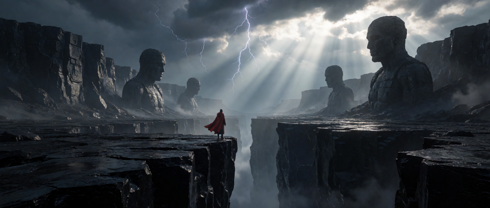

# krea2-loom

Krea 2 Turbo and Raw inference on the **Radeon 8060S (gfx1151)**. GPU kernels
are written in [Loom](https://github.com/ROCm/hrx-system); the Rust host uses
HRX's C API. The native CLI runs the complete pipeline without Python or PyTorch.

The runtime reads ComfyUI's int8 ConvRot checkpoints directly, using W8A8
transformer GEMMs, fp16 attention, a Qwen3-VL-4B text encoder and a Qwen-Image
VAE. Model weights are not included.

## Gallery

Both images are Turbo at eight steps, about 28 s each on an idle 8060S, and each
command reproduces its image exactly.


*1344×768, seed 64. Camera and film language rather than "photorealistic,
hyperdetailed" — naming the effect tends to produce concept art, describing the
optics produces a photograph.*

```sh
krea2 --width 1344 --height 768 --seed 64 --out planetrise.png \
  -p "Wide cinematic telephoto photograph taken twenty minutes after sunset, composed on the rule of thirds: the ringed planet's disc sits on the upper right third intersection, the sea horizon runs along the lower third line, the cliff edge falls on the left third line. Deep indigo sky overhead, darkening to a narrow band of burnt orange along the horizon, first stars showing high in the frame. An enormous ringed planet stands well clear above the sea with open uninterrupted sky between it and the horizon, still catching direct sunlight so it burns bright against the dark sky, its cloud bands sharply defined in cream and rust, the ring plane cutting a crisp dark shadow across its face. On the left a colossal fluted basalt sea cliff, its wet columns catching the last warm orange light along one edge and falling into deep blue shadow. A lone figure in a pale pressure suit on a ledge, tiny, backlit. A heavy ocean swell rolls in and breaks hard against the foot of the cliff, exploding into white spray that bursts up the rock face, long streaks of foam sweeping from the lower left corner across the water toward the planet, churning whitewater filling the bottom of the frame, wave crests catching the last orange light. Clean empty sky below the planet. Canon EOS R5, 300mm f/4, ISO 800, fast enough to freeze the spray, correct exposure holding both the bright planet and open shadow detail, fine grain, strong colour contrast between cool sky and warm rim light."
```



*1504×640, seed 9 — 2.35:1. Regenerated: the original was made by the C++ host,
whose noise generator the Rust port replaced, so its seed no longer reproduces
that frame.*

```sh
krea2 --width 1504 --height 640 --seed 9 --out canyon.png \
  -p "a lone figure in a red cloak standing at the edge of a vast obsidian canyon, colossal ancient statues half-buried in the far cliffs, storm light breaking through thunderclouds, volumetric god rays, cinematic wide shot, epic scale, photorealistic, fine detail"
```

## Requirements

- Linux with an accessible Radeon 8060S and the amdgpu/KFD driver. Other GPUs
  are not supported by the current kernels.
- A Rust toolchain and the native build tools required by its dependencies.
- The prebuilt HRX/Loom/HSA bundle managed by the shared `hrx.rs` crate.
- The model files below and enough memory to keep the models and GPU workspace
  resident. The transformer checkpoint alone is about 13 GB.

Builds, tests, and model execution use Rust. Kernel sources are maintained directly
in `crates/kernels/kernels`. See the [runtime guide](docs/hrx-runtime.md) for deployment
and [native tests](docs/testing.md) for validation.

## Install

From this checkout. The shared runtime is a pinned dependency, so no sibling
checkout is needed to build; the `hrx` runner is what stages the native bundle:

```sh
cargo install --locked --git https://github.com/zacharydenton/hrx-rs --rev 64ad045 --features runner hrx-rs
hrx prepare
cargo install --locked --path cli
```

The native bundle is pinned by hash. See the
[runtime guide](docs/hrx-runtime.md) for what `hrx prepare` fetches.

## Models

Use the files from [Comfy-Org/Krea-2](https://huggingface.co/Comfy-Org/Krea-2)
in this layout (the default root is `~/comfy-models`):

```text
comfy-models/
├── diffusion_models/
│   ├── krea2_turbo_int8_convrot.safetensors
│   └── krea2_raw_int8_convrot.safetensors     # optional
├── text_encoders/
│   └── qwen3vl_4b_bf16.safetensors
└── vae/
    └── qwen_image_vae.safetensors
```

The `qwen3vl_4b_fp8_scaled.safetensors` text encoder is also supported; bf16 is
preferred when both are present. An existing ComfyUI models directory works
without conversion.

To download missing models through the Hugging Face cache, use a model name:

```sh
krea2 --model krea2_turbo_int8_convrot -p "a red fox in the snow"
```

Explicit model paths require local weight files. `HF_HUB_OFFLINE=1` disables
network access, including the optional tokenizer lookup; the embedded tokenizer
is available offline.

## Generate

```sh
krea2 -p "a red fox in the snow" --out fox.png
krea2 --models /path/to/comfy-models -p "a lighthouse at dusk" \
  --width 768 --height 1024 --seed 7 --out lighthouse.png
printf '%s\n' "a mountain lake at dawn" | krea2 --checkpoint raw \
  --negative "blurry" --guidance 3.5 --out lake.png
```

| Checkpoint | Default steps | Default guidance |
| --- | ---: | --- |
| Turbo | 8 | Disabled |
| Raw | 52 | 3.5, using `cond + g * (cond - uncond)` |

`--steps` overrides the step count. `--images N` uses consecutive seeds and
numbered output files. Dimensions must be multiples of 16 between 64 and 2048;
text plus image tokens must fit the 16,896-token limit. PNG output is selected
by `.png`; other extensions produce binary PPM.

Use `--model`, `--text-encoder` and `--vae` for individual files. The checkpoint
name selects the sampler unless `--checkpoint` overrides it. `krea2 --help`
lists all options. `KREA2_NATIVE_PROFILE=1` enables diagnostic stage timings.

## Libraries

A checkout build produces `build/krea2`. The workspace crates are the interface:
`krea2-pipeline` for prompt-to-RGB generation and the individual pipeline
components, `krea2-session` for resident transformer block sessions. Both are
ordinary Rust libraries, usable as a git dependency.

There is no C ABI. Consuming applications bind the Rust crates directly — an
Elixir application wraps `krea2_pipeline::Pipeline` with Rustler, which needs no
C boundary, no generated headers and no error-buffer protocol. See the
[runtime and deployment guide](docs/hrx-runtime.md) for lifetimes and threading.

## Performance and accuracy

Local measurements on one idle Radeon 8060S, 2026-09-08: 1024×1024 Turbo,
eight Euler steps, batch one, prompt `a red fox in the snow`.

| Warm median | ComfyUI INT8 ConvRot | krea2-loom W8A8 |
| --- | ---: | ---: |
| Generation | 36.31 s | 27.30 s |
| VAE decode | 0.652 s | 0.586 s |

These small local samples are not hardware-wide guarantees. Timer boundaries,
precision and initial noise differ between backends; speed measurements do not
establish image equivalence. See [the comparison](docs/comfyui-performance.md)
and [VAE measurements](docs/vae-performance.md) for methodology and limitations.

The default fp16 attention has the best measured trajectory agreement among
the supported modes. Int4/int8 QK attention is opt-in with `--attn i4` or
`--attn i8`. [Attention documentation](docs/native-attention.md) covers the
quality tradeoff. Native seeds are repeatable within this backend; use identical
initial latents for comparisons with Torch.

## Development

See [CONTRIBUTING.md](CONTRIBUTING.md) for builds, tests and benchmark requirements.

- [Architecture and numerical contracts](docs/notes.md)
- [Runtime, caches and deployment](docs/hrx-runtime.md)
- [Attention kernels](docs/native-attention.md)
- [VAE performance](docs/vae-performance.md)
- [ComfyUI comparison](docs/comfyui-performance.md)

## License

Project code is [MIT licensed](LICENSE). The bundled Qwen tokenizer has its
[own attribution and Apache-2.0 license](crates/tokenizer/assets/README.md). Model weights are
separate downloads governed by their upstream licenses.
