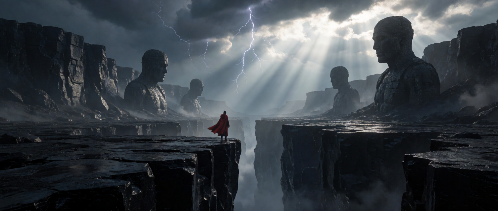

# krea2-hrx

**Krea 2 image generation on AMD Strix Halo, powered by Loom kernels and HRX.**

Run **Krea 2 Turbo and Raw** locally on **AMD Strix Halo**
with custom **Loom GPU kernels** and the **HRX runtime**. The complete text-to-image
pipeline runs on Linux without Python or PyTorch.
[Loom and HRX](https://github.com/ROCm/hrx-system) provide kernel compilation,
GPU execution, memory management, and caching behind the native `krea2` CLI.

- **Loom kernels, HRX execution:** specialized GPU kernels compiled and cached
  through the shared runtime.
- **Complete inference pipeline:** Qwen3-VL-4B text encoding, Krea 2 diffusion
  transformer, and Qwen-Image VAE decoding.
- **ComfyUI checkpoint support:** load int8 ConvRot safetensors directly, with
  W8A8 transformer GEMMs and fp16 attention.
- **Local generation:** use existing model files or download them through the
  Hugging Face cache; generate PNGs from a prompt, seed, and image dimensions.

This is an independent community implementation. Current kernels target the
Radeon 8060S (gfx1151) in Strix Halo;
other GPUs are unsupported. Model weights are separate downloads.

[Quick start](#quick-start) · [Models](#models) · [Gallery](#gallery) ·
[Benchmarks](#benchmarks-and-accuracy) · [Contributing](CONTRIBUTING.md)

## Requirements

- Linux with an accessible Radeon 8060S and the amdgpu/KFD driver. Other GPUs
  are not supported by the current kernels.
- Rust 1.91 or newer (the crate's `rust-version`), and the native build tools
  its dependencies require.
- The prebuilt unified HRX/Loom bundle managed by the shared `hrx.rs` crate.
- The model files below and enough memory to keep the models and GPU workspace
  resident. The transformer checkpoint alone is about 13 GB.

Builds, tests, and model execution use Rust. Kernel sources are maintained directly
in `kernels`. See the [runtime guide](docs/hrx-runtime.md) for deployment
and [native tests](docs/testing.md) for validation.

An experimental native trainer supports character LoRAs and full RAW fine-tuning. See
[training](docs/training.md) for its configuration, CPU checks, and remaining
GPU validation. It uses Rust, Loom and HRX throughout.

## Quick start

Clone the repository and install the runtime CLI:

```sh
git clone https://github.com/zacharydenton/krea2-hrx.git
cd krea2-hrx

cargo install --locked hrx-rs --version 0.8.9
hrx prepare
cargo install --locked --path .

krea2 -p "a red fox in the snow" --out fox.png
```

The repository and Cargo package are named `krea2-hrx`; the installed command is
`krea2`. The first generation downloads missing models and compiles kernels, so
it takes longer than a warm run. See [Models](#models) to reuse local weights.

The native bundle is pinned by hash. See the
[runtime guide](docs/hrx-runtime.md) for what `hrx prepare` fetches.

## Models

Models from [Comfy-Org/Krea-2](https://huggingface.co/Comfy-Org/Krea-2) are downloaded
and reused in the **standard Hugging Face cache**, normally
`~/.cache/huggingface/hub`. No separate models directory is needed:

```sh
krea2 -p "a red fox in the snow"                     # Turbo by default
krea2 --checkpoint raw -p "a mountain lake at dawn"
```

`HF_HUB_CACHE` overrides the cache directory. Otherwise it is `$HF_HOME/hub`,
with `HF_HOME` defaulting to `$XDG_CACHE_HOME/huggingface` when set, or
`~/.cache/huggingface`. Existing cached downloads are reused before network access.
`HF_HUB_OFFLINE=1` requires cached or local weights and disables downloads.
HF boolean variables follow the [standard convention](https://huggingface.co/docs/huggingface_hub/package_reference/environment_variables#boolean-values):
`1`, `ON`, `YES`, and `TRUE` enable them (case-insensitive); other values, including
`false`, leave them disabled. The bundled tokenizer needs no download.

The checkpoint, Qwen3-VL-4B text encoder, and Qwen-Image VAE all resolve through
the cache automatically, pinned to upstream revision
[`e5ea8b4dd7f38f348b138eb0fe29f92c0e367e96`](https://huggingface.co/Comfy-Org/Krea-2/tree/e5ea8b4dd7f38f348b138eb0fe29f92c0e367e96).
The default text encoder is always BF16. To use FP8, pass its file explicitly
with `--text-encoder`; cache contents never change the default precision.

To select a checkpoint by name explicitly:

```sh
krea2 --model krea2_turbo_int8_convrot -p "a red fox in the snow"
```

For individual files outside the cache, pass explicit paths. They can live
anywhere; no directory layout is required. Components without an override
continue to use the HF cache.

```sh
krea2 --model /path/to/checkpoint.safetensors --checkpoint turbo \
  --text-encoder /path/to/encoder.safetensors --vae /path/to/decoder.safetensors \
  -p "a lighthouse at dusk"
```

## Generate

```sh
krea2 -p "a red fox in the snow" --out fox.png
krea2 -p "a lighthouse at dusk" \
  --width 768 --height 1024 --seed 7 --out lighthouse.png
printf '%s\n' "a mountain lake at dawn" | krea2 --checkpoint raw \
  --negative "blurry" --guidance 3.5 --out lake.png
```

| Checkpoint | Default steps | Default guidance |
| --- | ---: | --- |
| Turbo | 8 | Disabled |
| Raw | 52 | 3.5, using `cond + g * (cond - uncond)` |

`--steps` overrides the step count. `--images N` uses consecutive seeds and
numbered output files. Dimensions must be multiples of 16 between 64 and 2048;
text plus image tokens must fit the 16,896-token limit. Output supports `.png`
and `.ppm` (case-insensitive); unsupported extensions fail before model loading.

Use `--model`, `--text-encoder` and `--vae` for individual files. Custom checkpoint
paths require `--checkpoint turbo` or `--checkpoint raw`; the two built-in model
identifiers select their corresponding sampler. Filenames are never guessed.
`krea2 --help` lists all options. Invalid arguments exit with code 2; model,
runtime, and file I/O failures exit with code 1. `KREA2_NATIVE_PROFILE=1` prints
synchronized stage timings and a per-kernel breakdown of the transformer blocks,
measured on the GPU clock where the runtime supports it; profiled runs are
slower, so do not time them.

## Gallery

Both images use Turbo at eight steps. Seeds
are repeatable within this backend; output can change with kernel or runtime
revisions.


*1344×768, seed 64. Camera and film language rather than "photorealistic,
hyperdetailed" — naming the effect tends to produce concept art, describing the
optics produces a photograph.*

<details>
<summary>Generation command</summary>

```sh
krea2 --width 1344 --height 768 --seed 64 --out planetrise.png \
  -p "Wide cinematic telephoto photograph taken twenty minutes after sunset, composed on the rule of thirds: the ringed planet's disc sits on the upper right third intersection, the sea horizon runs along the lower third line, the cliff edge falls on the left third line. Deep indigo sky overhead, darkening to a narrow band of burnt orange along the horizon, first stars showing high in the frame. An enormous ringed planet stands well clear above the sea with open uninterrupted sky between it and the horizon, still catching direct sunlight so it burns bright against the dark sky, its cloud bands sharply defined in cream and rust, the ring plane cutting a crisp dark shadow across its face. On the left a colossal fluted basalt sea cliff, its wet columns catching the last warm orange light along one edge and falling into deep blue shadow. A lone figure in a pale pressure suit on a ledge, tiny, backlit. A heavy ocean swell rolls in and breaks hard against the foot of the cliff, exploding into white spray that bursts up the rock face, long streaks of foam sweeping from the lower left corner across the water toward the planet, churning whitewater filling the bottom of the frame, wave crests catching the last orange light. Clean empty sky below the planet. Canon EOS R5, 300mm f/4, ISO 800, fast enough to freeze the spray, correct exposure holding both the bright planet and open shadow detail, fine grain, strong colour contrast between cool sky and warm rim light."
```

</details>



*1504×640, seed 9 — 2.35:1. Regenerated: the original was made by the C++ host,
whose noise generator the Rust port replaced, so its seed no longer reproduces
that frame.*

<details>
<summary>Generation command</summary>

```sh
krea2 --width 1504 --height 640 --seed 9 --out canyon.png \
  -p "a lone figure in a red cloak standing at the edge of a vast obsidian canyon, colossal ancient statues half-buried in the far cliffs, storm light breaking through thunderclouds, volumetric god rays, cinematic wide shot, epic scale, photorealistic, fine detail"
```

</details>

## Rust library

`cargo build --release` produces `target/release/krea2`; `scripts/build.sh` also
copies it to `build/krea2`. To use the library from another Rust project:

```toml
[dependencies]
krea2 = { package = "krea2-hrx", git = "https://github.com/zacharydenton/krea2-hrx" }
```

Pin a `rev` for reproducible downstream builds. The Rust import remains `krea2`:
`krea2::pipeline` provides prompt-to-RGB generation and the individual
pipeline components; `krea2::session` provides resident transformer block sessions.
For custom checkpoint paths, library callers select the sampler with
`Files::of(path).distilled(Some(true))` for Turbo or `Some(false)` for Raw.
Every call returns `krea2::Error`: `is_invalid_argument()` separates
the caller's mistakes from runtime failures, which keep their `hrx::Error`, and
`Error::Cancelled` reports a progress callback that stopped generation.

There is no C ABI. Consuming applications bind the Rust library directly — an
Elixir application wraps `krea2::pipeline::Pipeline` with Rustler, which needs no
C boundary, no generated headers and no error-buffer protocol. See the
[runtime and deployment guide](docs/hrx-runtime.md) for lifetimes and threading.

## Benchmarks and accuracy

Run the Criterion benches on gfx1151:

```sh
cargo bench --bench kernels
cargo bench --bench generation -- generation/1024x1024
```

Generation requires cached model weights. See [benchmark setup](CONTRIBUTING.md#benchmarks)
for timing boundaries and requirements. Results stay outside version control.
Attention uses fp16 products with fp32 softmax; the [parity gate](docs/testing.md)
checks complete trajectories against the unquantized BF16 model. Use identical
initial latents for comparisons with other backends.

## Development

See [CONTRIBUTING.md](CONTRIBUTING.md) for builds, tests and benchmark requirements.
CPU checks run in GitHub Actions; GPU tests require the supported hardware.
Report bugs and feature requests through [GitHub Issues](https://github.com/zacharydenton/krea2-hrx/issues).

- [Architecture and numerical contracts](docs/notes.md)
- [Runtime, caches and deployment](docs/hrx-runtime.md)
- [Attention kernels](docs/native-attention.md)

## License

Rust and Loom code is [MIT licensed](LICENSE). The bundled Qwen tokenizer has its
[own attribution and Apache-2.0 license](assets/README.md). Model weights are
separate downloads governed by their upstream licenses.
